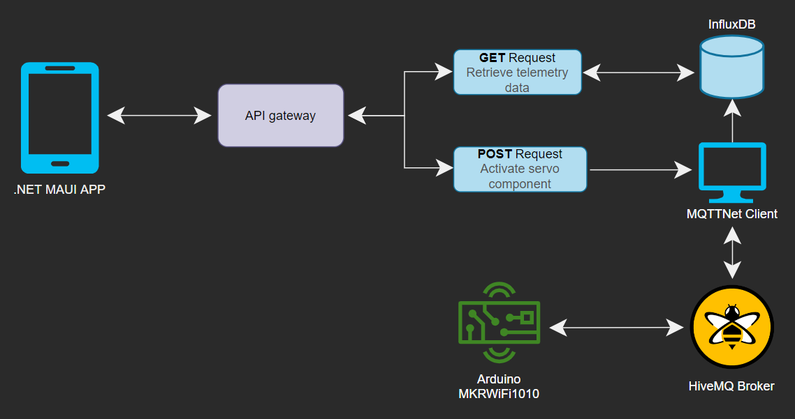

# MAUI mobile app - School project

## Introduction
This project is a school assignment, where we wish to display telemetry data, such as `Temperature` and `Humidity` as well as a `TimeStamp` as to when the readings have been read - in the visualization of a chart, so that any user can get an overview of the readings.

The readings come from a previous project, where we have made a `Web API` which stores and also gets the data from a Database.

## Architecture diagram
This is a diagram to give an overview of how the whole solution speaks together and where we're collecting our data from and what device is giving us the wanted data for the graphs on the mobile application.

## Projects
| Project   | Platform                                                                                                    | Language |
|-----------|-------------------------------------------------------------------------------------------------------------|----------|
| `App`     | [.NET MAUI](https://learn.microsoft.com/en-us/dotnet/maui/what-is-maui)                                     | C#       |
| `API`     | [.NET RESTApi](https://learn.microsoft.com/en-us/aspnet/core/fundamentals/minimal-apis?view=aspnetcore-7.0) | C#       |
| `Arduino` | [Arduino MKR WiFi 1010](https://store.arduino.cc/products/arduino-mkr-wifi-1010)                            | C++      |

## API Overview and Endpoints
| API                      | Description                                 | Request body | Response body                |
|--------------------------|---------------------------------------------|--------------|------------------------------|
| `GET/telemetries`        | Get **all** Measurement items               | None         | Array of Measurement items   |
| `POST/servo`             | Write to a servo                            | string       | None                         |
| `GET/latestTelemetry`    | Get the latest Measurement reading          | None         | Single object of Measurement |
| `GET/telemetry/lastHour` | Get **all** Measurement items the last hour | None         | Array of Measurement items   |
| `GET/telemetry/lastDay`  | Get **all** Measurement items the last day  | None         | Array of Measurement items   |
| `GET/telemetry/lastWeek` | Get **all** Measurement items the last week | None         | Array of Measurement items   |

## MQTT Topics
| Topics                      | Client             | Publish/Subscribe type | Body sample                                                                                               | Description                                                                                                                                                                          |
|-----------------------------|--------------------|------------------------|-----------------------------------------------------------------------------------------------------------|--------------------------------------------------------------------------------------------------------------------------------------------------------------------------------------|
| `telemetry/home/led`        | TelemetryAppClient | Publish                | `{ "HIGH / LOW" }`                                                                                        | Tell a device to turn a LED `ON` or `OFF`                                                                                                                                            |
| `telemetry/home/#`          | TelemetryAppClient | Subscribe              | `{ "location": "living-room", "temperature": 22.45, "humidity": 40, "time": "2023-05-22T20:10:43.511Z" }` | Receive a `jSon object` reading sensor values from the **MKRWiFi1010_Client**.                                                                                                       |
| `telemetry/home/{location}` | MKRWiFi1010_Client | Publish                | `{ "location": "living-room", "temperature": 22.45, "humidity": 40, "time": "2023-05-22T20:10:43.511Z" }` | Publishing sensor values, being serialized into a `jSon object` so that we can receive it in our **TelemetryAppClient** and use that data to display in our `.NET MAUI` applikation. |

## Requirements
 - [x] Show latest reading of `Temperature` and `Humidity` and the meassured times in local time.
 - [x] Show a graph of the meassurements, where you can choose between latest hour, day and week.
 - [x] It needs to have a button, which can activate a servo and simulate opening a window or turning on for the ventilation.
 - [x] The App needs to be built upon MVVM design pattern and contain Dependency injection.
 - [ ] Is robust toward an unstable internet connection.
 - [x] The project is turned in through a Github repository, with a good README.md file, which is presented for the class and teacher.

## Optional requirements
 - [ ] The opportunity to choose different meassurement readings, eg. the different rooms in the house.
 - [ ] An alarm which will advertise that the `Temperature` is out of its limit - high or low.
 - [ ] Can show latest data, if the network disconnects.

## Use of third parties
| Package name                                                                             | Version |
|------------------------------------------------------------------------------------------|---------|
| [CommunityToolkit.Mvvm](https://learn.microsoft.com/en-us/dotnet/communitytoolkit/mvvm/) | 8.2.0   |

