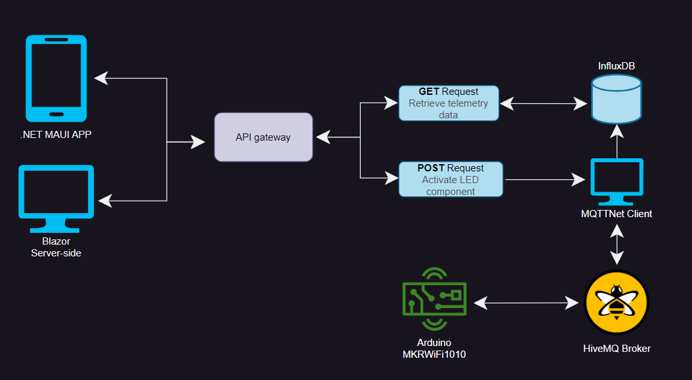

# MAUI mobile app - School project

## Introduction
This project is a school assignment, where we wish to display telemetry data, such as `Temperature` and `Humidity` as well as a `TimeStamp` as to when the readings have been read - in the visualization of a chart, so that any user can get an overview of the readings.

The readings come from a previous project, where we have made a `Web API` which stores and also gets the data from a Database.

An extension to the project, is that we now also wish to display the same data, just on a web application - which will be made in a `Blazor Server` application. 

## Architecture diagram
This is a diagram to give an overview of how the whole solution speaks together and where we're collecting our data from and what device is giving us the wanted data for the graphs on the mobile application.

<details>
  <summary>Click to see a description of the diagram flow</summary>
    
  So, we have our `2 applications` which will be the user interfaces of our entire solution. They will talk through a `API gateway` to retrieve and push data down through the solution.
    
  The API gateway also have a `POST` so when either of our **2 applications** will trigger a `switch component`, it will send either a `HIGH` or `LOW` as the body sample and pass it through the **MQTTNet Client** who publishes messages down to the **HiveMQ Broker** through the topic `telemetry/home/led`. The **Arduino board** is subscribed to that specific topic and is waiting for messages. Once it receives a message, the `builtin LED` will either light up or turn off, depending on the message's body sample.

  The **API gateway** can send several `GET` requests down to our **Influx database** to retrieve `Measurement` data. This data is coming through a **MQTTNet Client** which is `subscribed` to the topic `telemetry/home/#` to establish a connection with a **HiveMQ Broker** to recieve messages getting send to that specific topic. The **HiveMQ Broker** is getting messages from an **Arduino board** which has a `DHT11 sensor` reading and publishing every 30 seconds on new `Temperature` and `Humidity` readings through the topic `telemetry/home/{location}` so the **Influx database** is constantly fed with data.

</details>
    


## Projects
| Project   | Platform                                                                                                    | Language |
|-----------|-------------------------------------------------------------------------------------------------------------|----------|
| `App`     | [.NET MAUI](https://learn.microsoft.com/en-us/dotnet/maui/what-is-maui)                                     | C#       |
| `API`     | [.NET RESTApi](https://learn.microsoft.com/en-us/aspnet/core/fundamentals/minimal-apis?view=aspnetcore-7.0) | C#       |
| `Arduino` | [Arduino MKR WiFi 1010](https://store.arduino.cc/products/arduino-mkr-wifi-1010)                            | C++      |
| `Web`     | [Blazor server-side](https://learn.microsoft.com/en-us/aspnet/core/blazor/?view=aspnetcore-7.0)             | C#       |

## API Overview and Endpoints
| API                        | Description                                      | Request body | Response body                |
|----------------------------|--------------------------------------------------|--------------|------------------------------|
| `GET/telemetries`          | Get **all** Measurement items                    | None         | Array of Measurement items   |
| `POST/servo`               | Write to a servo                                 | string       | None                         |
| `GET/latestTelemetry`      | Get the latest Measurement reading               | None         | Single object of Measurement |
| `GET/telemetry/lastHour`   | Get **all** Measurement items the last hour      | None         | Array of Measurement items   |
| `GET/telemetry/lastDay`    | Get **all** Measurement items the last day       | None         | Array of Measurement items   |
| `GET/telemetry/lastWeek`   | Get **all** Measurement items the last week      | None         | Array of Measurement items   |
| `GET/telemetry/livingRoom` | Get **all** Measurement items in the Living room | None         | Array of Measurement items   |
| `GET/telemetry/kitchen`    | Get **all** Measurement items in the Kitchen     | None         | Array of Measurement items   |

## MQTT Topics
<table>
    <thead>
        <tr>
            <th>Topic</th>      
            <th>Pub/Sub</th>
            <th>Body sample</th>            
            <th>Description</th>
            <th>Client</th>
        </tr>
    </thead>
<tbody>
<tr>
<td>
    <i>telemetry</i>/home</i>/<i>led</i>
</td>
<td>
    Publish
</td>
<td>
    Sending "HIGH" or "LOW"
<td>
    Tell a device to turn a LED <b>ON</b> or <b>OFF</b> by using a switch on our .NET MAUI application. 
</td>
<td>
    <b>TelemetryAppClient</b>    
</tr>
<tr>
<td>
    <i>telemetry</i>/home</i>/<i>#</i>
</td>
<td>
    Subscribe 
</td>
<td>

```json
{
    "location": "living-room",
    "temperature": 22.5,
    "humidity": 10.2,
    "time": "2023-05-22T20:10:43.511Z"
}
```
<td>
    Receive a jSon object reading sensor values from the <b>MKRWiFi1010_Client</b>.    
</td>
<td>   
   <b>TelemetryAppClient</b>
</tr>
<tr>
<td>
    <i>telemetry</i>/home</i>/<i>{location}</i>
</td>
<td>
    Subscribe 
</td>
<td>

```json
{
    "location": "living-room",
    "temperature": 22.5,
    "humidity": 10.2,
    "time": "2023-05-22T20:10:43.511Z"
}
```
<td>    
    Publishing sensor values, being serialized into a jSon object so that we can receive it in our <b>TelemetryAppClient</b> and use that data to display in our .NET MAUI application.
</td>
<td>
    <b>MKRWiFi1010_Client</b>   
</tr>
</tbody>
</table>

## Requirements
 - [x] Show latest reading of `Temperature` and `Humidity` and the meassured times in local time.
 - [x] Show a graph of the meassurements, where you can choose between latest hour, day and week.
 - [x] It needs to have a button, which can activate a servo and simulate opening a window or turning on for the ventilation.
 - [x] The App needs to be built upon MVVM design pattern and contain Dependency injection.
 - [ ] Is robust toward an unstable internet connection.
 - [x] The project is turned in through a Github repository, with a good README.md file, which is presented for the class and teacher.
 - [ ] Make an equivalent Blazor server side application to display the same things.


## Optional requirements
 - [x] The opportunity to choose different meassurement readings, eg. the different rooms in the house.
 - [ ] An alarm which will advertise that the `Temperature` is out of its limit - high or low.
 - [ ] Can show latest data, if the network disconnects.

## Use of third parties
| Package name                                                                             | Version        |
|------------------------------------------------------------------------------------------|----------------|
| [CommunityToolkit.Mvvm](https://learn.microsoft.com/en-us/dotnet/communitytoolkit/mvvm/) | 8.2.0          |
| [LiveChartsCore.SkiaSharpView](https://lvcharts.com/docs/maui/2.0.0-beta.710/gallery)    | 2.0.0-beta.710 |
| [Polly](https://github.com/App-vNext/Polly)                                              | 7.2.3          |

